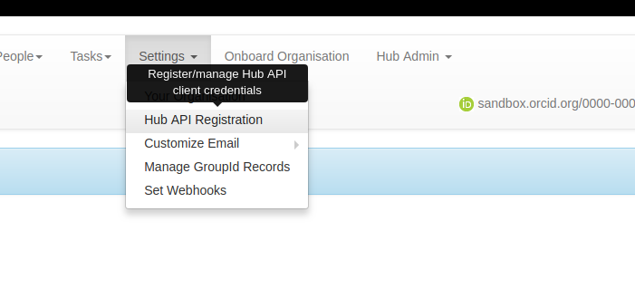
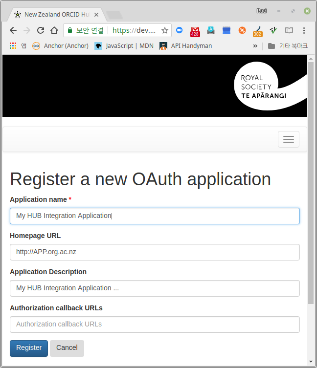
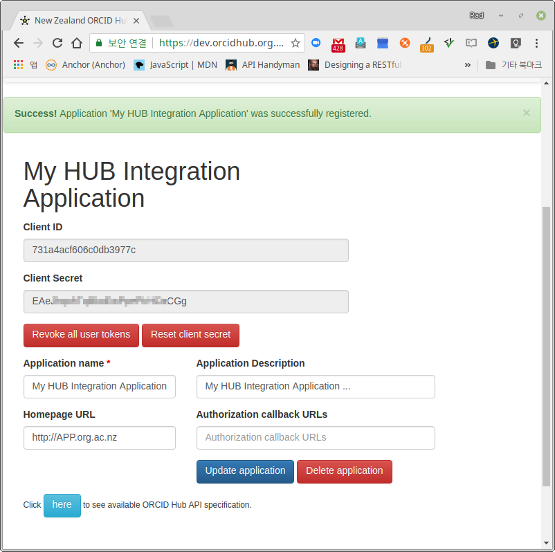
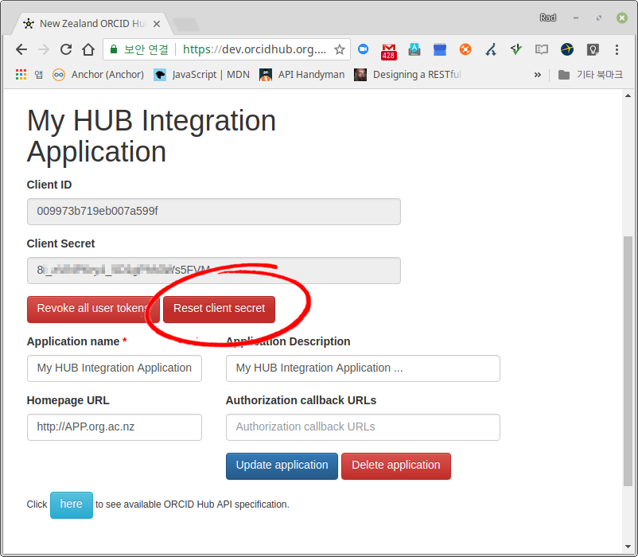

.. _app_registration:

ORCID Hub API Appliction Registration
=====================================

In order to use ORCID Hub API first you need to register your application navigating to ``Settings → Hub API Registration``:

When you register your application the Hub generates application credentials, a pair of keys: *CLIENT_ID* and *CLIENT_SECRET*:

You have to make sure that *CLIENT_SECRET* doesn't get compromised. Make sure you never make your client secret hard-coded in the source of your application. If you have even a slightest suspicion about having leaked the client secret immediately reset your application credentials using the same form:

