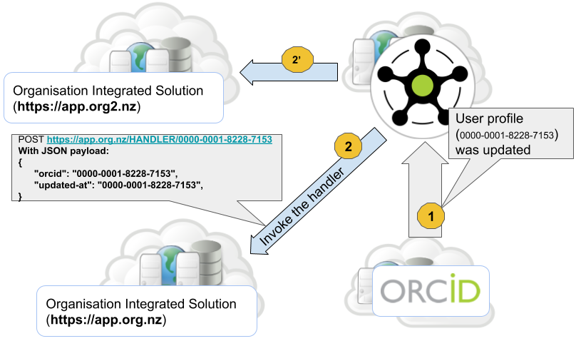
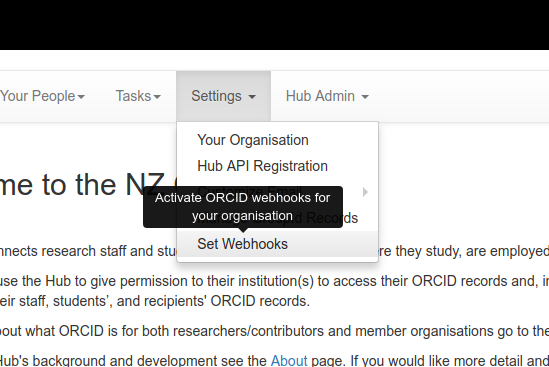
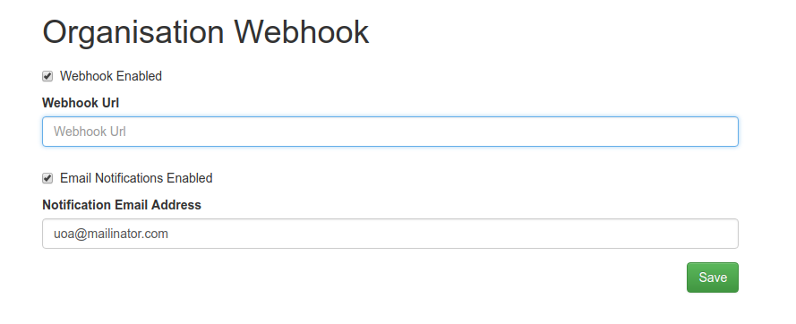
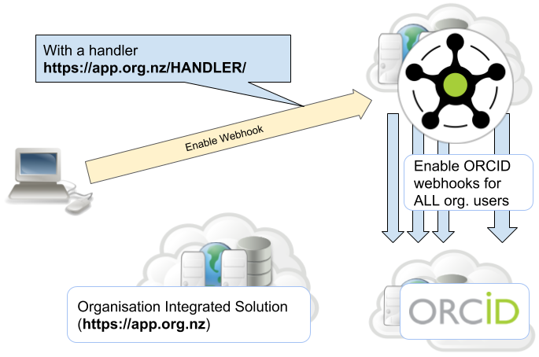

Webhooks
========

What is an ORCID webhook?
-------------------------

A webhook, according to `Wikipedia <https://en.wikipedia.org/wiki/Webhook>`_ is
"a method of augmenting or altering the behaviour of a web page, or web
application, with custom callbacks. These callbacks may be maintained,
modified, and managed by third-party users and developers who may not
necessarily be affiliated with the originating website or application.".

In simple terms, a webhook allows your application to receive notifications
from another application. In the ORCID context, the ORCID webhooks provide a
mechanism for receiving user profile update notifications, enabling
applications to be informed when data within an ORCID record changes.

What is an ORCID Hub webhook?
-----------------------------

The ORCID Hub (hereafter preferred to as "the Hub") provides efficient ways of
managing webhooks for all organisation users, so that you do not need to
register a webhook for each and every user yourself.

For those organisations that do not have their own integration solutions, the
Hub offers an email notification handler which sends an email notification upon
receiving a user record update event from ORCID Hub.

Here is how the organisation webhooks work:

#. When a user profile gets updated, the ORCID Hub triggers the Hub webhook
   update event handler.
#. The Hub handler, in turn, invokes the registered organisation webhook. If
   there are multiple organisations the user is affiliated with, all webhooks
   will be triggered.

    Webhooks in action

Webhook Registration
--------------------

In order to register an organisation webhook, you need to provide either a
handler URL or enable email notifications. The Hub, on your behalf, will take
care of registering the ORCID Webhooks for each and every one of your
organisation users. After registering an organisation webhook, the Hub will
take care to add a webhook for any new user who affiliates their profile with
your organisation.

    Navigation to the Webhook menu

..    include:: <isonum.txt>

First, navigate via **Settings → Set Webhooks** and fill out the ``Organisation
Webhook`` form. The Webhook URL should be your organisation applications
Webhook handler URL. If you do not have an integration solution and wish to
receive the notifications by email, leave this field empty, and, instead, check
the ``Email Notifications Enabled`` checkbox and click on ``Save``. By default,
email notifications will be sent to the organisation technical contact email
address. If you wish to have them sent to a different email address, fill in
the field ``Notification Email Address``.

    Webhook registration form

After saving the form the Hub will go through all the user records affiliated
with your organisation and register for each user an ORCID Webhook:

    Webhook Registration
